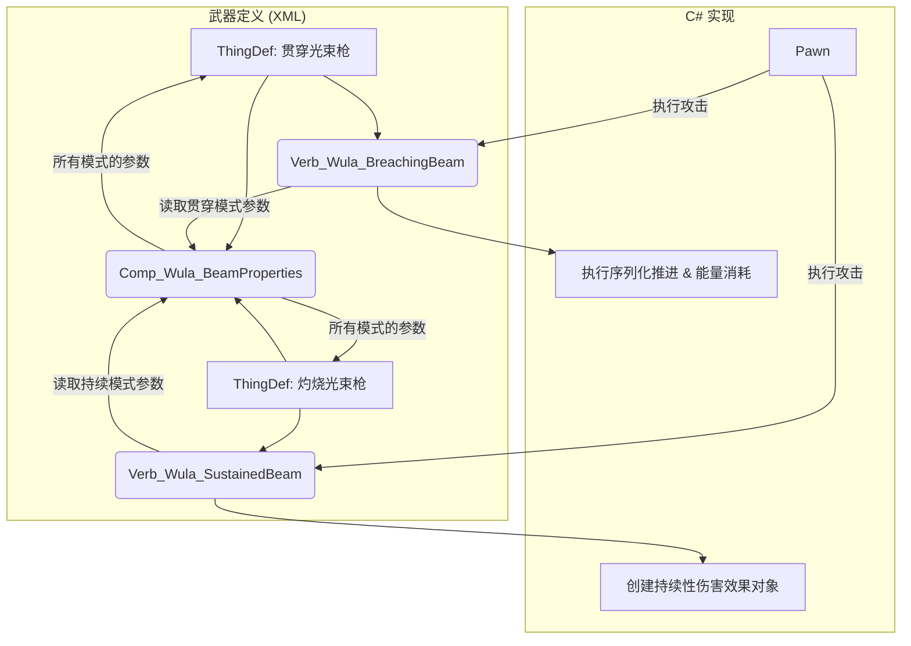

# 技术设计文档：模块化光束武器系统 (WULA Ionic Beam)

## 1. 设计哲学

*   **单一职责 (Less is More)**: 每个类只做一件事并把它做好。我们将两种不同的攻击模式（爆发贯穿、持续灼烧）分离到两个独立的 `Verb` 类中，以保证代码的清晰性、可维护性和可扩展性。
*   **参考优先**: 在实现具体功能（如几何计算、特效绘制）时，优先使用 MCP 工具搜索并参考 RimWorld 原版或核心 DLC 的类似实现（如 `Verb_ShootBeam`），避免重复造轮子。

## 2. 最终架构：双 Verb 系统

我们将构建一个由两个专用的 `Verb` 类和一个共享的 `Comp` 类组成的系统。这允许我们通过 XML 定义来创建两种行为截然不同的武器。

### 2.1. 核心组件

*   **`Verb_Wula_BreachingBeam` (C#)**: 专用于**爆发贯穿**模式。
*   **`Verb_Wula_SustainedBeam` (C#)**: 专用于**持续灼烧**模式。
*   **`Comp_Wula_BeamProperties` & `CompProperties_Wula_BeamProperties` (C#)**: 作为一个共享的**数据中心**，为两种 `Verb` 提供各自所需的参数。

### 2.2. 流程图



## 3. 模式详解

### 3.1. 模式一: 爆发贯穿 (`Verb_Wula_BreachingBeam`)

*   **核心机制**: 序列化推进与能量消耗。
*   **行为**: 发射一道拥有初始能量（伤害值）的光束。光束逐格前进，在击中物体时消耗能量造成伤害。如果能量足以摧毁物体，则继续前进；否则攻击停止。
*   **战术定位**: 反装甲、破阵、清除直线上的多个弱小目标。
*   **关键参数**: `damage` (初始能量), `beamWidth`。

### 3.2. 模式二: 持续灼烧 (`Verb_Wula_SustainedBeam`)

*   **核心机制**: 持续性范围伤害 (DoT)。
*   **行为**: 在指定方向上投射一道持续存在的光束。在光束持续时间内，周期性地（例如每 10 ticks）对光束路径上的所有敌人造成伤害。光束不被阻挡，总能延伸到最大射程。
*   **战术定位**: 区域拒止、对大量无甲目标造成总额很高的伤害、压制走位。
*   **关键参数**: `damagePerTick`, `tickInterval`, `duration`, `beamWidth`。

## 4. XML 定义示例

### 4.1. 贯穿光束枪 (模式一)

```xml
<ThingDef ParentName="BaseGun">
  <defName>WULA_Weapon_BreachingBeamGun</defName>
  <label>离子突破光束</label>
  <verbs>
    <li Class="VerbProperties">
      <verbClass>WULA.Verb_Wula_BreachingBeam</verbClass>
      <!-- 其他 Verb 参数: warmupTime, range, burstShotCount, etc. -->
    </li>
  </verbs>
  <comps>
    <li Class="WULA.CompProperties_Wula_BeamProperties">
      <damage>200</damage> <!-- 初始能量 -->
      <beamWidth>3</beamWidth>
    </li>
  </comps>
</ThingDef>
```

### 4.2. 灼烧光束枪 (模式二)

```xml
<ThingDef ParentName="BaseGun">
  <defName>WULA_Weapon_SustainedBeamGun</defName>
  <label>离子灼烧光束</label>
  <verbs>
    <li Class="VerbProperties">
      <verbClass>WULA.Verb_Wula_SustainedBeam</verbClass>
      <!-- 其他 Verb 参数: warmupTime, range, etc. -->
    </li>
  </verbs>
  <comps>
    <li Class="WULA.CompProperties_Wula_BeamProperties">
      <damagePerTick>15</damagePerTick> <!-- 每跳伤害 -->
      <tickInterval>10</tickInterval> <!-- 伤害间隔 -->
      <duration>120</duration> <!-- 持续时间 (ticks) -->
      <beamWidth>5</beamWidth>
    </li>
  </comps>
</ThingDef>
```

---
这份最终版设计文档现在完全体现了您的所有要求和我们共同确定的最佳实践。规划阶段已结束，下一步将是编码实现。